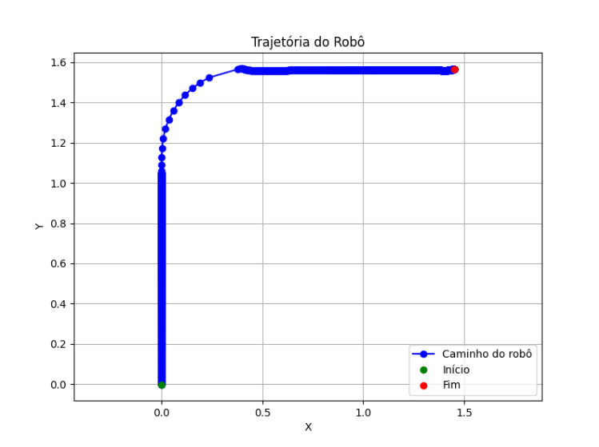
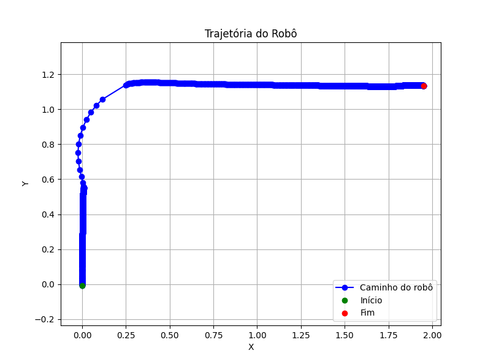

# Trajetória Robo Pioneer

|             Aluno             | Matrícula |
|:-----------------------------:|:---------:|
| João Antonio Ginuino carvalho | 221008150 |


---

## Sobre

Controle de trajetória do robo Pioneer para atingir multiplas bolas  controlando a movimentação do robo por meio da cinematica direta.

### Explicação demo1
O pioneer irá realizar a trajetória buscando todas as bolas e se movimentando a cada uma delas sem com base no ID da bola no coppeliaSim e cada bola que ele passa é salvo a trajetória no arquivo trajectory.csv em seguida ao fim da trajetória será plotado os pontos que ele passou. 

### Explicação demo1

Primeiramente é necessário montar uma trajetória para o robo pionner, o código começa identificando a posição da bola e em seguida caso a bola esteja alinhada no eixo X com robô o mesmo só movimenta para cima sem a necessidade de arcos e curvas, caso a bola esteja a direita do robo o mesmo segue até alinhar o eixo y com a posição da bola -0.5 (raio da curva), em seguida seguida realiza a curva e atinge a bola no eixo x andando a frente. Além disso, foi implementado o mesmo esquema de plot utilizado no demo1.

> Utilizei a controladora PID fornecida pelo Mario e o código atual é uma adaptação do código fornecido pelo Mário.


Plot da trajetória de multiplos pontos (pathPioneer.py):


Plot da trajetória a um ponto fixo (1.5, 1.5) usando as primitivas:



Plot da trajetória a um ponto fixo (2.0, 1.0) usando as primitivas:



Observação: As equações de cinemátiva inversa utilizadas estão na linha 52 e 53 do arquivo demo1 e 55 e 56 do demo2:

$$
\begin{aligned}
v_d &= \frac{2v + \omega L}{2R} \\
v_e &= \frac{2v - \omega L}{2R}
\end{aligned}
$$

````python
cinematic_right_speed = ((2 * max_linear_speed + angular_speed * distance_between_wheels) / (2 * wheel_radio))
cinematic_left_speed = ((2 * max_linear_speed - angular_speed * distance_between_wheels) / (2 * wheel_radio))
````

---

## Instalação

Linguagem: Python - 3.12

Biblioteca: numpy e matplotlib.pyplot

---

## Uso

Para multiplas bolas - abrir o arquivo **demo1.ttt** no coppeliaSim e executar o script **demo1.py**

Para única bola - abrir o arquivo **demo2.ttt** no coppeliaSim e executar o script **demo2.py**

