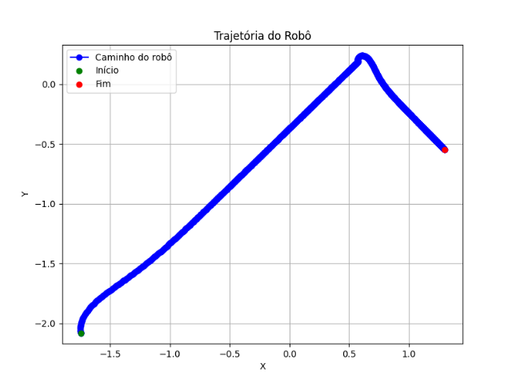
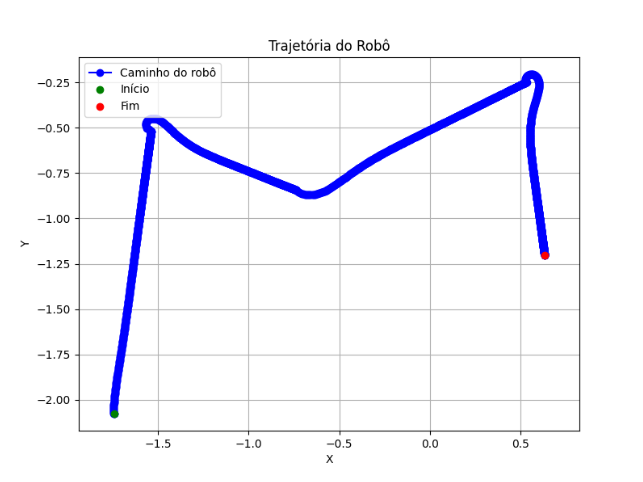

# Trajetória Robo Pioneer

|             Aluno             | Matrícula |
|:-----------------------------:|:---------:|
| João Antonio Ginuino carvalho | 221008150 |


---

## Sobre

Controle de trajetória do robo Pioneer para atingir multiplas bolas, fazendo o melhor caminho entre as bolas utilizando uma arvore geradora mínima e controlando a movimentação do robo por meio da cinematica direta.

O pioneer irá realizar a trajetória buscando todas as bolas e salvar cada ponto que ele passou no arquivo trajectory.csv em seguida ao fim da trajetória será plotado os pontos que ele passou. 


Plot da trajetória a um ponto fixo:


Plot da trajetória a um ponto variável, movimentando o ponto no decorrer do tempo:



Plot da trajetória de multiplos pontos:



Observação: As equações utilizadas estão na linha 52 e 53 do arquivo main:

````python
cinematic_right_speed = ((2 * max_linear_speed + angular_speed * distance_between_wheels) / (2 * wheel_radio))
cinematic_left_speed = ((2 * max_linear_speed - angular_speed * distance_between_wheels) / (2 * wheel_radio))
````

---

## Instalação

Linguagem: Python - 3.12

Biblioteca: numpy e matplotlib.pyplot

---

## Uso

Para única bola - abrir o arquivo **pioneer_one_ball.ttt** no coppeliaSim e executar o script **main.py**

Para multiplas bolas - abrir o arquivo **pioneer_multiples_balls.ttt** no coppeliaSim e executar o script **main.py**